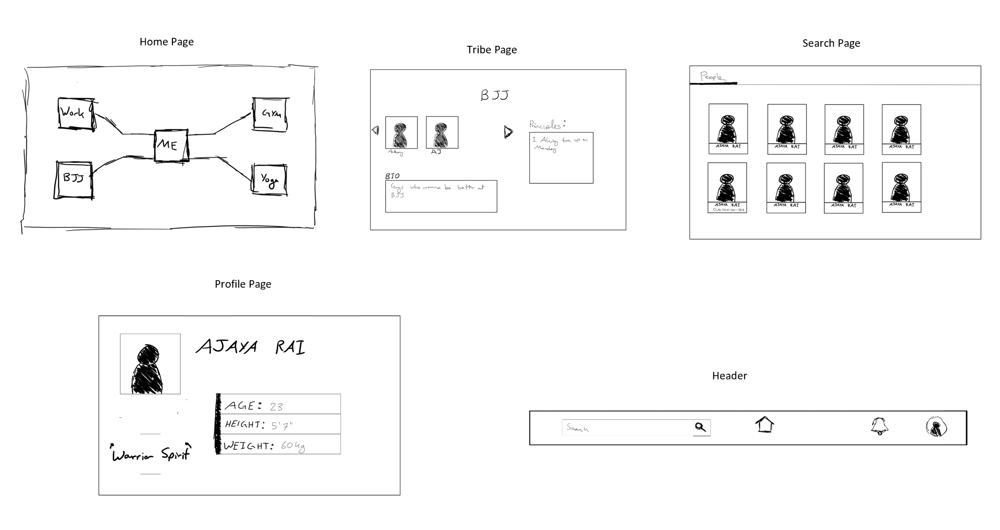

During the Challenge Week, I had set out to complete all the [logic](https://cseegit.essex.ac.uk/ce301_2020/ce301_rai_ajaya/-/blob/master/Challenge%20Week/Logic%202.drawio) for the MVP.
To open the file, follow the steps below:
1. Download the .io file
2. Go to [draw.io](https://app.diagrams.net/)
3. Click on "Open Existing Diagram"
4. Select the downloaded file
5. In the end, you should see the _flow chart_

After MVP, I wanted to focus on the GUI, as shown below:

