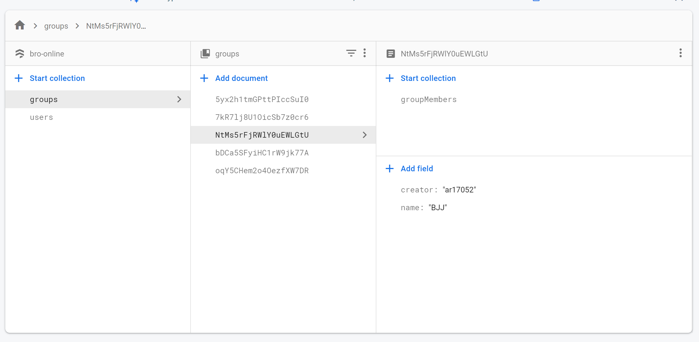
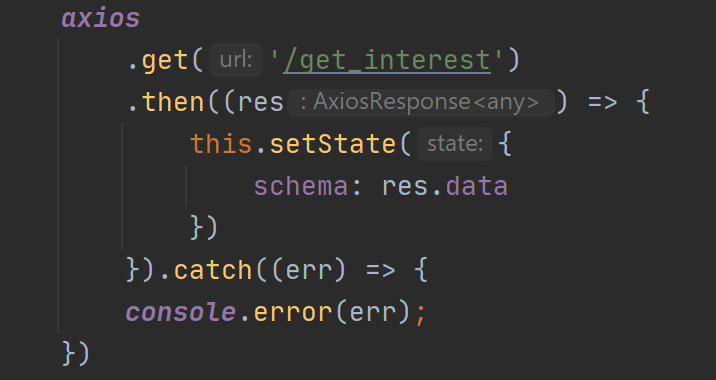
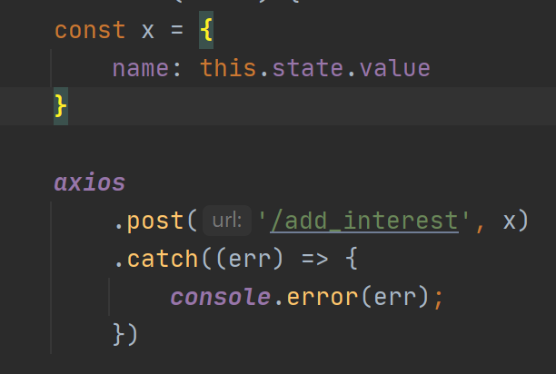

# Technical documentation

## Project Objective

The objective of the project is to build a website targeted towards male audience, which enables the user to create groups based on the individual work or interest. For example: a person could have hobbies such as GYM, coding, MMA; each of these hobbies can have its own group with different/same members in it.
A user should be able to join/leave groups as they please. 

### Flow Chart of the current product

### Backend
For backend, I have used 'Firebase', its a platform created by Google for developing mobile and web application. 

It offers multiple services:

I am using/planning to use:
- Cloud Firestore - real-time database, NoSQL document based
- Cloud Functions
- Authentication
- Cloud Storage

If you would like more detailed description of the services above, then please click [here](https://firebase.google.com/products#develop-products).

###### Database structure

User Collection:

Interests Collection (within User Collection):

Group Collection:

Group Members Collection:

<em>
Disclaimer: 
Haven't described the database images above because there is a risk that it may change in the future.
</em>

### Frontend
React is a library for building component based web application.
Complimenting it with;
- axios: used to communicate with the database
- react-router-dom: helps to navigate to different pages; e.g. from the HomePage to the GroupPage

###### Axios

The images below would make more sense if you look at the PostMan images on the <strong>Communication between Frontend and Backend</strong> section.

Get Request:

Post Request:

### Communication between Frontend and Backend
Get request:

Post Request:

